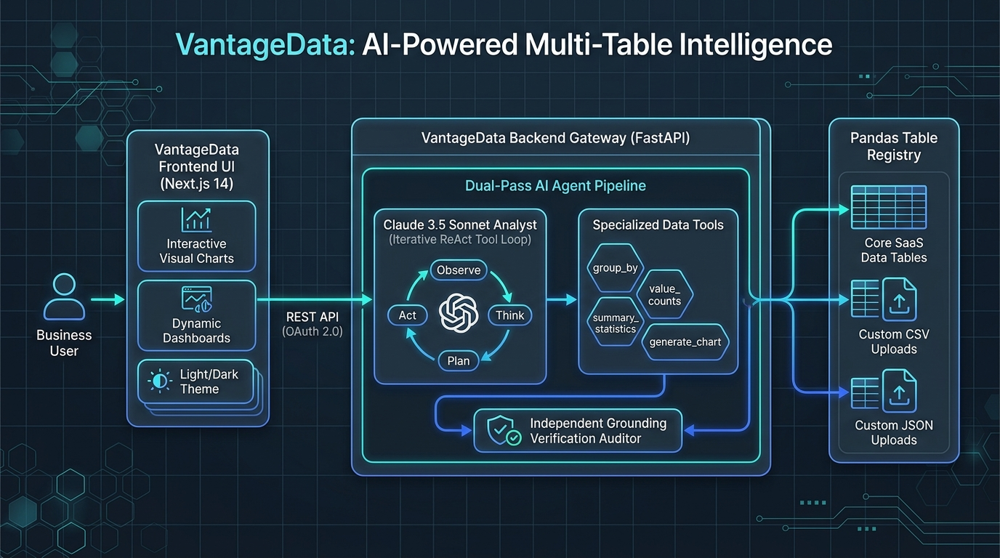
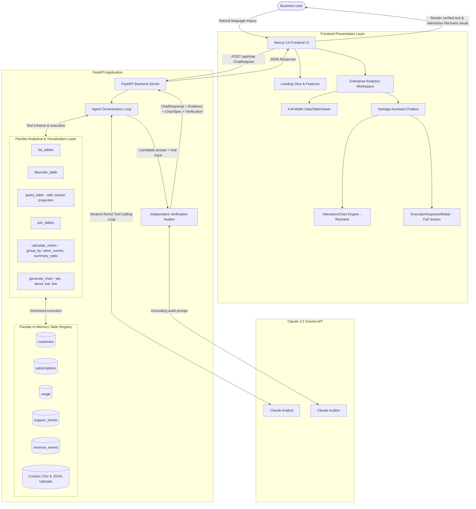

# System Architecture — VantageData v2.0

This document describes the high-level architecture, component interactions, and dataflow of the VantageData multi-table intelligence system.

---

## 1. System Architecture Overview



### High-Level Component Flow



---

## 2. End-to-End Execution Sequence

1. **User Request & Context Injection:** 
   - The user asks a natural language question (e.g., *"Show me a pie chart of customers by industry"*).
   - The active focused table in the UI (`focused_table`) is attached to the payload, priming the agent's context.
2. **Context Assembly:** 
   - FastAPI `/api/chat` constructs the prompt message list combining prior conversation history with the new question and active dataset context.
3. **Agent Planning Loop (`agent/loop.py`):**
   - Claude evaluates available tools defined in `tools/schema.py`.
   - Claude decides which analytical functions to call (e.g. `calculate_metric` with `value_counts` on `customers.industry`).
   - The backend runs vectorized Pandas operations in `tools/functions.py` across the full dataset.
   - Claude detects the request asks for a visual graph and calls `generate_chart(chart_type="pie", title=..., data=...)`.
   - The backend records a `ToolCallRecord` (tool name, arguments, row count, raw result) for full observability.
4. **Clarification Intercept:** 
   - If the question is truly ambiguous, Claude emits `NEED_CLARIFICATION: <question>`, returning immediately with `is_clarification: true`.
5. **Independent Grounding Verification Pass (`agent/verify.py`):**
   - Claude is invoked in a separate, isolated session with the user question, candidate answer, and raw tool output logs.
   - The auditor checks every number, percentage, and claim. If an answer asserts dataset facts without executing tools in the current turn, it is flagged as unverified.
   - Returns `{ "verified": bool, "unsupported_claims": [...] }`.
6. **Response Delivery (`models/schemas.py`):**
   - The response includes the final synthesized text, typed `ChartSpec` (if chart tool was run), full `Evidence` object, and verification notes.
7. **Frontend Presentation (`components/`):**
   - Renders answer text.
   - Parses ````chart ```` blocks or `response.chart` and renders interactive **Recharts Pie / Donut / Bar / Line** visualizations with live view toggles.
   - Displays `VerifiedBadge` (green verified, purple clarification, or amber review required).
   - Provides expandable `EvidencePanel` and full-screen `ExecutionInspectorModal` to view raw tool payloads.

---

## 3. Component Directory Structure

```
Zscaler/
├── architecture_diagram.jpg        # Architecture drawing illustration
├── README.md                       # Quickstart, setup, and overview
├── DECISIONS.md                    # Architectural decision records (ADRs)
├── AI_USAGE.md                     # LLM usage, prompt design, and guardrails
├── ARCHITECTURE.md                 # System architecture and dataflow
├── docker-compose.yml              # Multi-container orchestration
│
├── backend/
│   ├── Dockerfile                  # Python 3.11 container definition
│   ├── requirements.txt            # FastAPI, Anthropic SDK, Pandas, Pytest
│   ├── .env.example                # Environment template
│   ├── .env                        # Local environment config
│   ├── app/
│   │   ├── main.py                 # FastAPI application, CORS, health check
│   │   ├── config.py               # Typed configuration from environment
│   │   ├── data/                   # Default business JSON tables
│   │   │   ├── customers.json
│   │   │   ├── subscriptions.json
│   │   │   ├── usage.json
│   │   │   ├── support_tickets.json
│   │   │   └── revenue_events.json
│   │   ├── storage/
│   │   │   └── registry.py         # In-memory DataFrame TableRegistry
│   │   ├── tools/
│   │   │   ├── schema.py           # Anthropic function-calling schemas
│   │   │   └── functions.py        # Pandas analytics (group_by, value_counts, generate_chart)
│   │   ├── agent/
│   │   │   ├── loop.py             # 5-turn ReAct tool loop & evidence tracker
│   │   │   ├── prompts.py          # System prompt, rules, and verification templates
│   │   │   └── verify.py           # Independent factual verification auditor
│   │   ├── models/
│   │   │   └── schemas.py          # Pydantic request/response/chart models
│   │   └── routes/
│   │       ├── chat.py             # POST /api/chat route handler
│   │       └── tables.py           # GET /api/tables and POST /api/tables/upload
│   └── tests/
│       ├── test_tools.py           # Unit tests for pure tool functions & analytics
│       ├── test_data_files.py      # Unit tests for static dataset loading
│       └── test_api.py             # Unit tests for API routes and validation
│
└── frontend/
    ├── Dockerfile                  # Node 20 container definition
    ├── package.json                # Next.js 14, React 18, Recharts, Lucide icons
    ├── tsconfig.json               # Strict TypeScript configuration
    ├── next.config.js              # Next.js build configuration
    ├── .env.local                  # Local environment configuration
    ├── app/
    │   ├── layout.tsx              # Root layout, metadata, and ThemeProvider
    │   ├── page.tsx                # Client page mounting Landing / Workspace
    │   └── globals.css             # Design tokens, light & dark theme styling
    ├── context/
    │   └── ThemeContext.tsx        # React Context for Light & Dark mode switching
    ├── components/
    │   ├── Navbar.tsx              # Top navigation bar with theme toggle
    │   ├── LandingHero.tsx         # Product landing page with feature badges
    │   ├── Workspace.tsx           # Enterprise workspace with synced dataset context
    │   ├── DataTableViewer.tsx     # Full-width table explorer with dataset switcher dropdown
    │   ├── InteractiveChart.tsx    # Recharts visual charting component (Pie, Bar, Line)
    │   ├── ChatWindow.tsx          # Standalone chat container
    │   ├── MessageBubble.tsx       # User & assistant chat bubbles
    │   ├── EvidencePanel.tsx       # Collapsible audit trail & tool pipeline
    │   ├── ExecutionInspectorModal.tsx # Full-screen execution inspector dialog
    │   ├── FileUpload.tsx          # CSV & JSON drag-and-drop uploader modal
    │   └── VerifiedBadge.tsx       # Grounding status indicator badge
    ├── lib/
    │   └── api.ts                  # Typed Fetch API client
    └── types/
        └── index.ts                # TypeScript interfaces matching backend schemas
```
