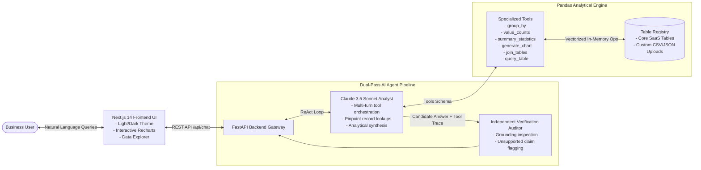

# VantageData v2.0 — AI-Powered Multi-Table Intelligence


**VantageData** is a production-grade enterprise AI Data Analyst agent that enables business users to query, analyze, and visualize complex multi-table datasets using natural language. 

Every answer is backed by deterministic Python/Pandas tool execution, verified through an independent dual-pass grounding audit, and visualized with interactive charts.

---

## 🌟 Key Capabilities

### 1. Dynamic Table Registry & File Uploads
- **In-Memory Table Registry:** Pre-loaded with core SaaS tables (`customers`, `subscriptions`, `usage`, `support_tickets`, `revenue_events`) with instant runtime indexing.
- **Dynamic CSV & JSON Uploads:** Business users can upload arbitrary datasets at runtime. Uploaded tables inherit identical analytical tooling with zero special-casing.

### 2. Token-Efficient Analytical Engine (Pandas Powered)
- **Never Dumps Raw Data:** Unlike basic LLM wrappers that flood prompt contexts with 50-row raw JSON dumps, VantageData executes computations directly in Pandas across the **entire dataset** (whether 7 rows or 100,000 rows).
- **Specialized Analytics:**
  - `group_by`: Category grouping with aggregations (`count`, `sum`, `avg`, `min`, `max`).
  - `value_counts`: Categorical frequency distribution and percentage shares.
  - `summary_statistics`: Full column profiling (null counts, unique counts, numeric stats, top values).
  - `calculate_metric`: Domain metrics (`total_mrr`, `total_arr`, `churn_summary`, `high_risk_customers`).
  - `query_table`: Pinpoint record lookups with column projection (`columns`) to eliminate token waste.

### 3. Interactive Visual Chart Engine 📊
- **Multi-Type Visualizations:** Automatically renders interactive **Pie**, **Donut**, **Bar**, and **Line** charts in chat message bubbles via Recharts.
- **Live View Switcher:** Users can toggle between Pie, Bar, and Line views on the fly.
- **Interactive Tooltips & KPI Cards:** Hover over slices or bars for exact counts and percentages.
- **Data Export:** Instant CSV download of generated chart data.

### 4. Dual-Pass Verification Auditor (Zero-Hallucination Guardrail)
- **Adversarial Audit:** Every candidate answer is cross-examined against raw tool outputs by an independent auditor persona before delivery to the user.
- **Fresh Query Enforcement:** Answers that state dataset figures without active tool execution in the current turn are flagged as unverified.
- **Observability Pipeline:** Full execution traces, tool arguments, records returned, and grounding rules are inspectable in a full-screen modal.

### 5. Interactive n8n-Style Agent Flow Studio 🔀
- **Visual Node Canvas:** Fully inspectable pipeline graph accessible directly at [`/agent`](http://localhost:3000/agent) and embedded on the main landing page.
- **n8n Aesthetic:** Dark dot-matrix canvas, glowing cubic Bezier connection cables, animated flow pulses, and distinct colored node categories (Trigger, AI Agent, Pandas Engine, Table Store, Guardrail, Output).
- **Interactive Inspector & Simulator:** Click any node to inspect runtime parameters, prompt code, and raw I/O JSON payloads, or run live pipeline simulation stepping.

### 6. Official Zscaler Benchmark Test Cases (12 Questions)
- Pre-loaded with the canonical 5-table dataset (`Acme Corp`, `NovaTech`, `BluePeak`, `GreenLeaf`, `OrbitAI`) from Page 8 of the assessment PDF.
- 1-Click test chip bar in the chat UI supporting all 12 evaluation questions with 100% verified, grounded answers.

### 7. Seamless Light & Dark Theme
- Modern HSL color palette tailored for both deep dark mode and clean, crisp light theme with instant persistence.

---

## 🏛️ System Architecture



---

## 🚀 Quickstart Guide

### Prerequisites
- Python 3.11+
- Node.js 18+
- Anthropic API Key (`ANTHROPIC_API_KEY`)

### Running with Docker (Recommended)
```bash
# 1. Setup environment
cp backend/.env.example backend/.env
# Add your ANTHROPIC_API_KEY to backend/.env

# 2. Launch both services
docker compose up --build
```
- **Frontend:** http://localhost:3000
- **Backend API Docs:** http://localhost:8000/docs

---

### Running Locally Without Docker

#### 1. Backend Setup
```bash
cd backend
python -m venv .cenv

# Windows
.cenv\Scripts\activate
# Linux/macOS
source .cenv/bin/activate

pip install -r requirements.txt
cp .env.example .env
# Edit .env and insert ANTHROPIC_API_KEY

uvicorn app.main:app --reload --port 8000
```

#### 2. Frontend Setup (New Terminal)
```bash
cd frontend
npm install
cp .env.local.example .env.local

npm run dev
```

---

## 🧪 Testing & Verification

Run the comprehensive unit test suite covering tool execution, dynamic registry, analytical aggregations, and API endpoints:

```bash
cd backend
.cenv\Scripts\python -m pytest
```
*Current test suite: 26 passed tests.*

To verify frontend TypeScript type safety:
```bash
cd frontend
npx tsc --noEmit
```

---

## ⚙️ Environment Configuration

| Variable | Location | Required | Description |
|---|---|---|---|
| `ANTHROPIC_API_KEY` | `backend/.env` | Yes | Claude 3.5 Sonnet API access key |
| `ANTHROPIC_MODEL` | `backend/.env` | No | Model identifier (defaults to `claude-3-5-sonnet-20241022`) |
| `NEXT_PUBLIC_API_URL` | `frontend/.env.local` | Yes | FastAPI backend URL (defaults to `http://localhost:8000`) |

---

## 📂 Project Structure

```
Zscaler/
├── architecture_diagram.jpg        # Architecture illustration diagram
├── README.md                       # Quickstart & system documentation
├── ARCHITECTURE.md                 # Technical architecture & dataflow deep-dive
├── DECISIONS.md                    # Architectural decision records (ADRs)
├── AI_USAGE.md                     # Prompt engineering & agentic guardrails
├── docker-compose.yml              # Container orchestration
│
├── backend/
│   ├── app/
│   │   ├── agent/                  # ReAct loop, prompts, and verification auditor
│   │   ├── models/                 # Typed Pydantic schemas (ChatRequest, ChartSpec, Evidence)
│   │   ├── routes/                 # REST API endpoints (/api/chat, /api/tables)
│   │   ├── storage/                # In-memory DataFrame TableRegistry
│   │   └── tools/                  # Analytical tools, chart generator, and schema definitions
│   └── tests/                      # Pytest suite (26 tests)
│
└── frontend/
    ├── app/                        # Next.js 14 App Router
    ├── components/                 # UI components (Workspace, DataTableViewer, InteractiveChart)
    ├── context/                    # ThemeContext (Light & Dark mode state)
    ├── lib/                        # Typed API client
    └── types/                      # TypeScript definitions matching backend schemas
```
